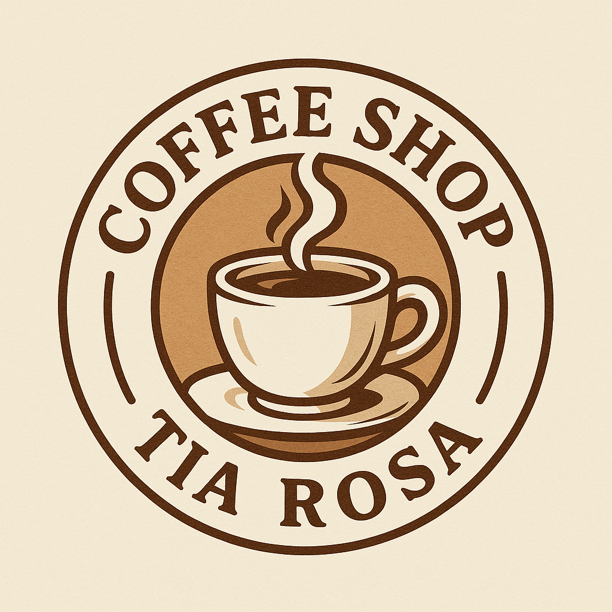

# cofee_shops_tia_rosa
 
# Relatório do código

# 📝 **Relatório Explicativo — Código HTML**

### ✅ **1. Estrutura Básica do Documento**

O código inicia com a declaração `<!DOCTYPE html>`, definindo o tipo do documento como HTML5. O elemento `<html lang="pt-BR">` indica que a linguagem principal do conteúdo é o português do Brasil.

---

### ✅ **2. `<head>`: Cabeçalho do Documento**

Contém metadados e links importantes:

- `<meta charset="UTF-8">`: define a codificação como UTF-8 (acentos e caracteres especiais).
- `<meta name="viewport" content="width=device-width, initial-scale=1.0">`: torna o site responsivo.
- `<link rel="stylesheet" href="style.css">`: importa o arquivo de estilos CSS externo.
- `<link rel="stylesheet" href="https://cdnjs.cloudflare.com/...">`: importa a biblioteca **Font Awesome** para uso de ícones.
- `<title>`: define o título da aba do navegador.

---

### ✅ **3. `<body>`: Conteúdo Visível do Site**

### 🔹 **Container Principal**

- `<div class="container">` envolve todo o conteúdo da página para fins de organização e estilo.

---

### ✅ **4. Navbar (Barra de Navegação)**

```html
<div class="navbar-container">
    <nav>
        <a href="#">
            
        </a>
        <ul class="navbar-items">...</ul>
    </nav>
</div>
```

- Exibe o **logo da cafeteria**.
- Possui links de navegação para diferentes seções da página (`#precos`, `#loc`, `#contact`).
- Algumas opções estão comentadas (ex: “Home”, “Entrar”).

---

### ✅ **5. Main Banner e Botão de Topo**

```html
<div class="main-banner">
    <h1>COFFEE SHOPS TIA ROSA</h1>
    <p>O melhor dos coffee shops!</p>
</div>
```

- Um **banner principal** com título e subtítulo.
- Inclui um botão de rolagem para o topo (ainda sem conteúdo visível).

---

### ✅ **6. Seção: Services**

```html
<section class="services-container">...</section>
```

- Apresenta **três qualidades da cafeteria**: Inovação, Rapidez e Atendimento.
- Cada item possui um ícone (com Font Awesome), um título e uma descrição.

---

### ✅ **7. Seção: Preços**

```html
<section class="pricing-container">
    ...
    <div class="plans-container">
        <div class="plan">...</div>
        ...
    </div>
</section>
```

- Lista alguns dos produtos mais vendidos com seus preços.
- Estrutura organizada em **cartões (plans)** individuais.
- Alguns botões “Saber mais” estão comentados.

---

### ✅ **8. Seção: Localização**

```html
<section class="search-container">
    <h2 id="loc">Nossa localização!</h2>
    <iframe src="..."></iframe>
</section>
```

- Integra o **Google Maps** com a localização do IESB – Asa Sul.
- Usa um iframe incorporado e responsivo com carregamento otimizado.

---

### ✅ **9. Seção: Contato**

```html
<section class="contact-container">
    <h2 id="contact">Venha nos visitar!</h2>
    ...
    <form id="whatsapp-form">...</form>
</section>
```

- Permite que o usuário envie seu nome e uma mensagem.
- A ideia é que a mensagem vá para o WhatsApp da cafeteria (a lógica ainda precisa ser implementada com JS).
- Campo de telefone está comentado.

---

### ✅ **10. Rodapé**

```html
<footer>
    <p>COFFEE SHOPS TIA ROSA @ 2025</p>
</footer>
```

- Informa os direitos do site com o nome da cafeteria e o ano.

# 📝 **Relatório Explicativo — Código CSS**

## 🎯 1. Comportamento de Rolagem

```css
html {
    scroll-behavior: smooth;
}
```

- Habilita a rolagem suave ao clicar em links com `href="#id"`.

---

## 🎨 2. Estilos Gerais

```css
* {
    margin: 0;
    padding: 0;
    font-family: Arial, Helvetica, sans-serif;
    box-sizing: border-box;
}
```

- Remove espaçamentos padrões dos elementos.
- Define a fonte principal e o `box-sizing` como `border-box`, que facilita o controle de largura/altura dos elementos.

```css
h1, h2, h3 {
    color: rgb(30, 48, 71);
}

p {
    color: rgb(102, 103, 104);
}
```

- Define as cores de títulos e parágrafos, promovendo uma paleta consistente.

---

## 🔝 3. NavBar

```css
.navbar-container {
    width: 100%;
    height: 80px;
    background-color: #f3e9d3;
    padding: 0 2rem;
}

```

- Área fixa no topo com fundo bege claro.

```css
.logo {
    width: 80px;
}
.logo:hover {
    transition: 0.5s;
    transform: scale(0.9);
}
```

- Reduz a logo ao passar o mouse.

```css
.navbar-items li {
    display: inline-block;
    text-transform: uppercase;
    margin-right: 35px;
}
```

- Os itens da navbar ficam alinhados horizontalmente.

```css
.navbar-items a:hover {
    background-color: #ffffff2a;
    border-radius: 5px;
}
```

- Realça os links no hover com leve fundo branco translúcido.

---

## ⬆️ 4. Botão Voltar ao Topo

```css
.btn {
    position: fixed;
    bottom: 10px;
    right: 10px;
    background-color: #2cc76a;
}
.btn::after {
    content: "↑";
    font-size: 32px;
}
```

- Botão redondo com seta para cima, posicionado no canto inferior direito.

---

## 🏞️ 5. Main Banner

```css
.main-banner {
    background-image: url(img/logo2.png);
    padding: 10rem 0;
}
```

- Exibe imagem de fundo ocupando grande parte da tela.

```css
.main-banner h1,
.main-banner p {
    text-shadow: #000 3px 2px 3px;
}
```

- Títulos com sombra preta para melhorar a leitura.

---

## 🧰 6. Serviços

```css
.services-container ul {
    display: flex;
}
.services-container li {
    flex: 1 1 200px;
    text-align: center;
}
```

- Layout em colunas com ícones centralizados.

```css
.fa-award, .fa-rocket, .fa-comments {
    color: personalizado por serviço.
}
```

- Ícones com cores únicas para destacar cada tipo de serviço.

---

## 💰 7. Planos e Preços

```css
.plan {
    max-width: 275px;
    margin: 0 20px;
}
.plan:hover {
    transform: scale(1.1);
}
```

- Cada plano tem efeito "zoom" ao passar o mouse.

```css
.plan .price {
    background-color: rgb(192, 115, 0);
}
.plan .plan-name {
    background-color: #66560f;
}
```

- Uso de círculos para destacar o preço.
- Estilo personalizado para o nome do plano.

---

## 🔍 8. Área de Busca

```css
.search-container {
    background-color: rgb(179, 162, 117);
    padding: 3rem 0;
}
.search-container input[type="text"] {
    width: 60%;
    font-size: 20px;
}
```

- Estilização clean para área de busca com fundo diferenciado e inputs centrais.

---

## 📩 9. Contato

```css
.contact-container input, .contact-container textarea {
    width: 90%;
    padding: 10px 20px;
}
```

- Campos amplos e responsivos para facilitar o preenchimento.

```css
.contact-container input[type="submit"] {
    background-color: #d1b492;
}
```

- Botão de envio com cor suave e efeito de opacidade.

---

## 👣 10. Footer

```css
footer {
    text-align: center;
    font-weight: bold;
}
```

- Rodapé centralizado e com destaque no texto.

---

## 📱 11. Responsividade

### 💻 Até 1100px

```css
.plan li {
    height: 150px;
}
```

### 📲 Até 900px e 576px

- Adapta a visualização para tablets e celulares.
- Altera tamanhos de fontes, coloca os planos em coluna e aumenta altura de alguns elementos como `#msg`.

### 📱 Até 375px

- Reduz o tamanho da logo, fontes e margens para caber melhor em telas pequenas.